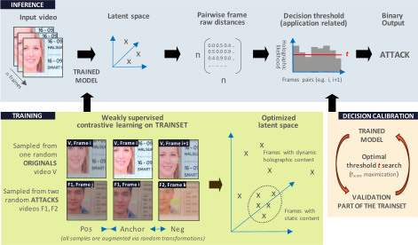

# pouliquen.24.icdar
Experimental protocol and results for the paper "Weakly Supervised Training for Hologram Verification in Identity Documents" accepted at ICDAR 2024 by Pouliquen et al.



## How to launch all the xp
After creating a Python3 environement (was tested with python 3.9) you can install all requirements with
```bash
pip install -r requirements.txt
```
The results were obtained using python3.9 and the requirements `jobs/requirements-exact.txt` using one NVIDIA RTX A5000.
## Generate the datasets
First download [MIDV Holo](https://github.com/SmartEngines/midv-holo) and `clips` from [MIDV 2020](http://l3i-share.univ-lr.fr/MIDV2020/midv2020.html) datasets.

then copy `markup`, `images` from [MIDV Holo](https://github.com/SmartEngines/midv-holo) to `data/midv-holo` 
and `dataset/clips` from [MIDV 2020](http://l3i-share.univ-lr.fr/MIDV2020/midv2020.html) to `data/midv-2020/clips`  
You should have:
```
data/
├── midv-2020
│   └── clips
│       ├── annotations
│       ├── images
├── midv-holo
│   ├── images
│   │   ├── fraud
│   │   └── origins
│   └── markup
│       ├── fraud
│       └── origins
```

Finally you can use the scripts `jobs/dataset/generate_data_midvholo.sh` and `jobs/dataset/generate_data_midvholo.sh` that will extract the datasets.  
They will create two new directories for each of the datasets: `rectified` and `crop_ovds`. 

```bash
# activate the python environement
bash jobs/dataset/generate_data_midvholo.sh
bash jobs/dataset/generate_data_midv2020.sh
```

## launch experiments
Launch the scripts from the `jobs` directory to reproduce all the experiments:

- `baseline`: MIDV Holo approach (re-implemention of the original MIDV Holo paper, see: https://github.com/SmartEngines/midv-holo)
    - `calibrate_baseline_fulldoc_nosplit.sh`: full document, decision "cumulative", unsplit MIDV-Holo dataset (original configuration proposed in the MIDV Holo paper)  
    Along with some variations, more in line with our proposed approach:
    - `calibrate_baseline_fulldoc_cumulative.sh`: full document, decision "cumulative"
    - `calibrate_baseline_cumulative.sh`: specific ROI, decision "cumulative"
    - `calibrate_baseline.sh`: specific ROI, decision "whole video"
               
- `wsl`: Our proposed Weakly Supervised Method:
    - `train_mobilevit.sh`: specific ROI, both decision mode, using a mobilevit.
    - `train_resnet.sh`: specific ROI, decision "whole video", using a resnet.
    - `train_mobilenet.sh` : specific ROI, decision "whole video", using a mobilenet
    - `train_mobilenet_small_50_noaugment.sh` : specific ROI, no augmentation, decision "whole video", using a mobilenet 
    - `train_mobilenet_small_50_onlyorigins.sh` : specific ROI, trained only on origins, decision "whole video", using a mobilenet 
    - `train_mobilevit.sh` : specific ROI, both decision mode, using a mobilevit.
    - `train_mobilevit_xxs_noaugment.sh` : specific ROI, no augmentation, decision "whole video", using a mobilevit
    - `train_mobilevit_xxs_onlyorigins.sh` : specific ROI, trained only on origins, decision "whole video", using a mobilevit
    - `train_resnet18.sh` : specific ROI, decision "whole video", using a resnet
    - `train_resnet18_noaugment.sh` : specific ROI, no augmentation, decision "whole video", using a resnet18
    - `train_resnet18_onlyorigins.sh` : specific ROI, trained only on origins, decision "whole video", using a resnet18 
    - `imagenet.sh`: specific ROI, decision "whole video", based on each of the 3 model archi (untrained, ImageNet initial weights).

- `classifier`: Binary classifer (to test naive baseline):
    - `mobilenet.sh`: specific ROI, decision "whole video"
    - `mobilevit.sh`: specific ROI, decision "whole video"
    - `resnet18.sh`: specific ROI, decision "whole video"

Those jobs were launched using:
- one GPU (NVIDIA RTX A5000) and 5 cpus per job for `wsl` and `classifer`  
- 30 cpus for the `baseline` jobs

### Results
Retrieve the results and format them :
`notebooks/export_test_results.ipynb`  
A csv file is provided to verify the results presented in the paper and some results were copied in markdown for an easier verification without having to run the notebook.


## Proposed Weakly supervised method
### Training deep learning models
Possible configurations :
- wsl : Weakly Supervised Learning
- classifier: Naive binary classifier

Possible architectures (pretrained on imagenet) :
- resnet
- mobilenetv3
- mobilevit
- any model from timm
```bash
python train.py --config-name=wsl +experiment=wsl/resnet18
```

### Decision threshold calibration  
Will find the best params if `tuner: True` (by default)
else runs with the params that were passed
for our deeplearning models (wsl and classification) it uses only the val set
```bash
python calibration.py --config-name=wsl +experiment=wsl/resnet18
```


### Testing
Retrieves the best run from the `task_name` on the train or validation dataset: one with the best fscore
use this model and params to run on test set
```bash
python test.py --config-name=wsl +experiment=wsl/resnet18
```
This example will only run on the split `k0` (default) but all experiments in `jobs` are runned on 5 splits (`k0` to `k4` in `data/splits_kfold_s0`) except the reproduction of the MIDV Holo baseline that is runned on the whole dataset.
## MIDV holo baseline

Midv Holo baseline reproduction

### Calibration

You can specify the parameters that you want to test:
```bash
python calibration.py --config-name=midv_baseline --multirun '+experiment=midv_baseline_fulldoc' 'decision.th=0.01' 'model.s_t=30,40,50' 'model.T=range(0,250,10)' "decision=cumulative"
```
A run with the exact same parameters will not be rerun

Later to test the best parameters
```bash
python test.py --config-name=midv_baseline --multirun '+experiment=midv_baseline_fulldoc' "decision=cumulative"
```

### Results
Results on the train/test splits can be retrieved using `notebooks/export_test_results.ipynb`

### Results of the reproduction of MIDV Holo (no split)
```bash
python calibration.py --config-name=midv_baseline -m +experiment=midv_baseline/midv_baseline_nosplit "model.T=range(0,250,10)" "model.s_t=30,40,50" "decision.th=0.01,0.02,0.03"
```
Retrieval of the results of the reproduction of MIDV Holo baseline:
`notebooks/AUC_baseline.ipynb`

## Visualization
In `notebooks/visualisation` two notebooks are present allowing to:
- visualize integrated gradient of the trained models : `notebooks/visualisation/model-interpretation.ipynb`
- visualize the transforms that were used for the wsl model (and binary classifiers) : `notebooks/visualisation/visu_transforms.ipynb`

## Framework
The framework was built using [Hydra](https://github.com/facebookresearch/hydra) ([documentation](https://hydra.cc/docs/)) and [MLflow](https://github.com/mlflow/mlflow) for logging experiments.